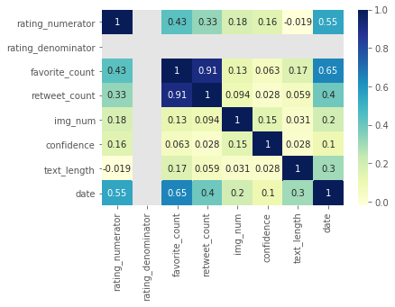
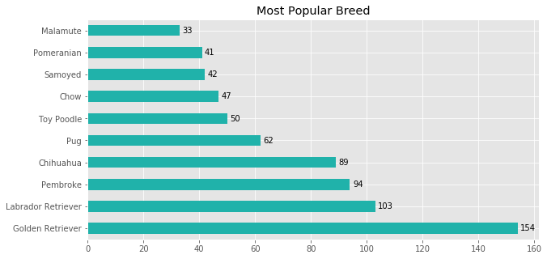
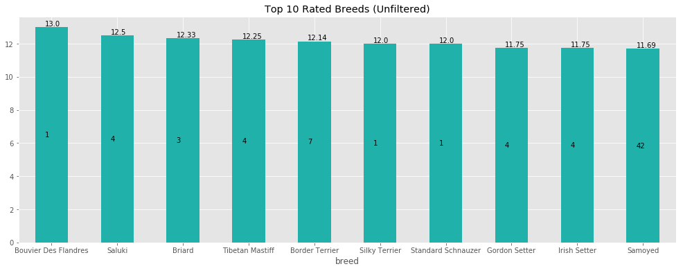
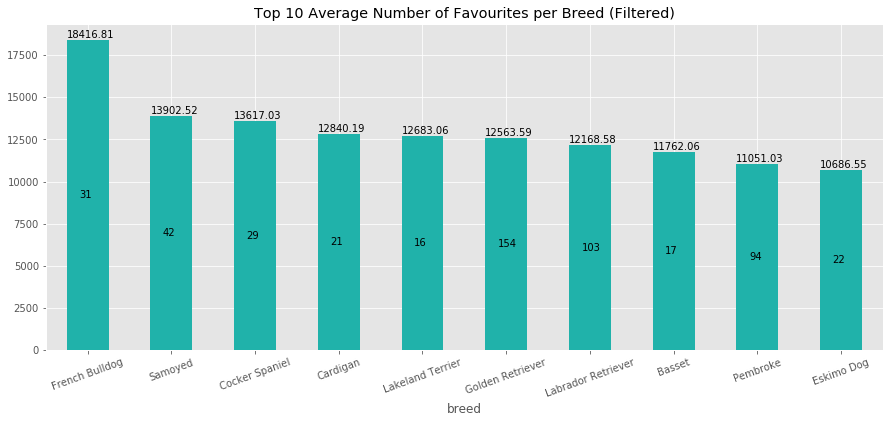
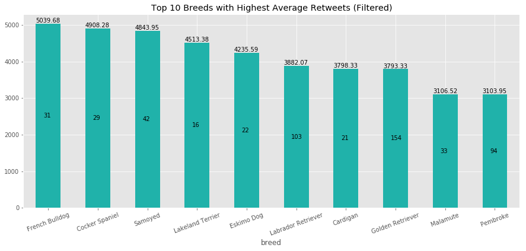
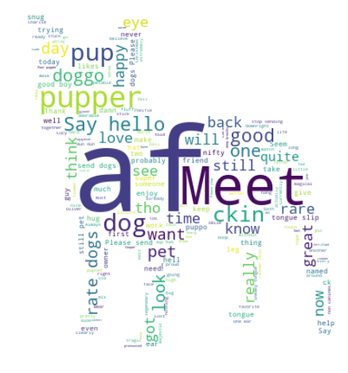

# Analysis Report
### written by: Toluwalase Tawak

## Project Goal
----------------------------
The goal of this project is to practice and familirise myself with data wrangling skills which include; Gathering, Assessment, Transformation, Cleaning, Visualisation and Analyis. These activities will be carried out on the twitter archive of the [@RateDogs](https://twitter.com/dog_rates) account. This account rates people's dogs with a humorous comment about the dogs.  
This README summarises how I approached the data wrangling for this project and displays the visualization(s) which produced my insights.

## Introduction
----------------------------------------
For this project, I worked with three dataset provided by Udacity. They each contained different information needed to carry out analysis and reporting.

The first dataset was a csv file named twitter_archive_enhanced, it contained information about 2356 tweets and was downloaded manually.

The second dataset was a tsv file named image_prediction, a [url](https://d17h27t6h515a5.cloudfront.net/topher/2017/August/599fd2ad_image-predictions/image-predictions.tsv) to the data was provided by udacity server which was I used to programmatically downloaded the file. It contained 2075 predictions classifying dogs by their breeds using pictures provided with tweets.

The third dataset, I [downloaded](https://video.udacity-data.com/topher/2018/November/5be5fb7d_tweet-json/tweet-json.txt) manually as txt file containing JSON of format of tweet informations. It contained extra information about tweets like the rewetet count, favorite count recieved for 2357 tweets.

The datasets were then assessed visually and programmatically for quality and tidiness issues. These issues wre addressed and corrected, a merge was carried on the three datframes to create one master datset which was then used to carry out investigative analysis.

### Cleaning Data
This section of the wrangling process was broken down into three parts:
>1. `Define`: Where the cleaning process to be carried out was explained
>2. `Code`: Code needed to achieve the cleaning goal defined was written and run.
>3. `Test`: Code was written and run to confirm that the cleaning goal was achieved.

To begin, copies of the three datasets were created. These copies were used to carry out the cleaning activities.  
Some of the cleaning proccesses carried out on the datasets are as follows:

* Some rows and columns containing null values were dropped.
* Attributes type were converted to appropriate type
* Some columns were concatanated, unpivot(ed) to form single columns
* The three datasets were merged

## Analysis and Visualisations
-------------------------------------

* We can see from the chart that there seems to be correlation between some attributes of our data. The strongest correlation can be observed between favourite count and retweet counts.  
* We can also see that the date column seems to have a relationship with the favourite count, rating numerator and to a much lesser extent retweet count and length of tweets. 

* The visual above shows us the popularity of breeds or occurrence of breeds rated by the twitter account.
* Terriers were the most talked about dogs
* Investigation shows that 6 of these breeds are small sized dogs

* The highest rated breed for popular(breeds that occur more than 14 times) breed is the Samoyed. 
* Golden Retriever which happens to be the most commonly tweeted dog is the second highest rated dog. 
* 5 of our most common breeds within the time frame of our entire data also happen to be among the Top 10 rated breeds.

* The French Bulldog and the Cocker Spaniel, small sized dogs, are two of the top 3 popular breeds for twitter users engagemets.

## Insights
--------------------

These includes other insights not shown in this summarised report. These can be found in the Jupyter notebook used to carry pou the wrangling and analysis process.

1. The handler of the this twitter account like to use the abbreviation "af" a lot. WHich means he/she liked to emphasize their description or sentiments for any dog they were rating.
2. Of the four different classisfication of dogs, Pupper was the handlers favourite description for dogs. From the 'dogtionary', these dogs are small or young dogs.
3. In the time period under consideration, the maximum number of characters for a tweet was 140. Therefore, the handler used a lot of long tweets, between 100 and 140 characters for most of their tweets.
4. The handler was very generous with ratings, giving most dogs a numerator 10 or more.
5. The two most popular breeds rated, were both Retrievers. If people sent their dog's pictures to be rated, most of the dogs owners who are aware of the account owned Retrievers (Golden and Labrador). If the handler found the pictures on their own, is it easier to find pictures of retrievers than other breeds ?
6. It appears the handler has a bias towards the Golden Retriever, as it is also closely the dog with second highest rating for popular dogs. The Labrador Retriever is also in the top 10 for popular dogs with the highest ratings.
7. The most popular dogs also had the most total engagements in terms of Favourites and retweets.
8. Followers of the accounts seemed to have lots of love for the French Bulldog, Cocker Spaniel and the Samoyed as they were the most popular dogs that received the most likes or retweets on average.
9. The Beddington Terrier and Saluki breeds are probably the breed followers of the account liked the most. They received the most total engagements on average even with their lack of popularity. (All though these engagement values could be skewed due to just one of their pictures receiving very very large number of engagements.)